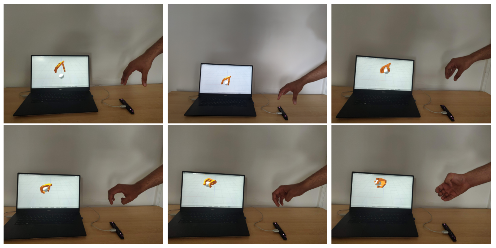
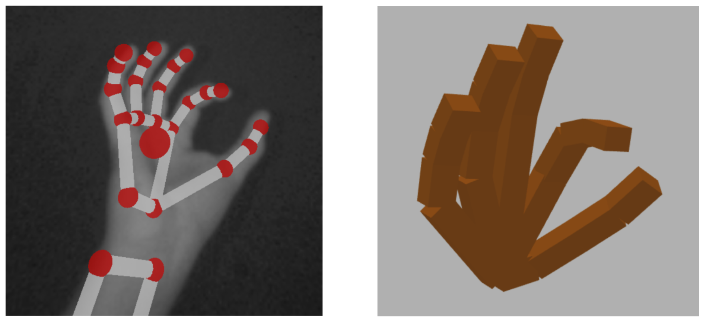
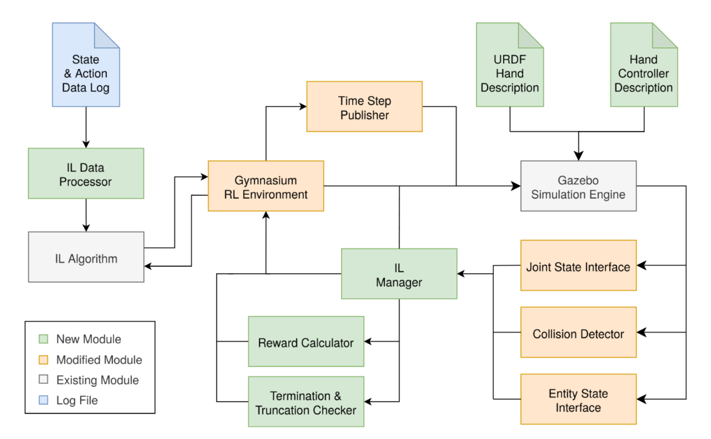

# Investigating How Dexterity Affects Imitation Learning in Humanoid Robotic-Hand Simulations

A research project (written in C++, Rust, and Python w/ Pytorch) to train robotic-hand simulations to perform common tasks such as picking up and moving objects.

This thesis presents the **first robotic-hand simulation to achieve human-level dexterity**: achieving state-of-the-art dexterity by mimicking all 27 degrees-of-freedom (DoF) of the human hand. 

We train the robotic hand to complete tasks in a simulated environment using reinforcement learning (hard-coded rewards) and imitation learning (learning rewards from human examples). 

### The Problem

Recently there has been a large investment into humanoid robots, especially into improving the dexterity of robotic hands and arms. However, few studies have investigated whether increasing dexterity improves the robot's ability to perform tasks. It could be that improving dexterity yields diminishing returns after a certain point.  

This thesis aims to answer the following questions about how a robotic-hand's dexterity affects its ability to: 
- Be controlled by a human (via teleoperation)
- Learn to perform tasks via reinforcement learning (without human demonstrations)
- Learn to perform tasks via imitation learning (with human demonstrations)

### Our Approach

Our novel robotics system allows a person to control the robotic hand _live_ with full human-level dexterity using hand-tracking technology. This lets us perform manual task demonstrations, which are used as training data by the imitation-learning algorithms.

We construct a 27 DoF robotic hand simulation using URDF specifications, which are then integrated into a [ROS](https://www.ros.org/) robotics system. This distributed system is used to connect together several components, including: live hand-tracking data, historical hand-tracking training data, reinforcement/imitation learning ML models, and hand-crafted PID controllers. 

### Our Results

Our results show that improving robotic-hand dexterity improves teleoperation, reinforcement learning, and most of all imitation learning (without producing diminishing returns). This provides strong evidence that continued advances in robotic dexterity will drive substantial improvements in both robotic learning and control.